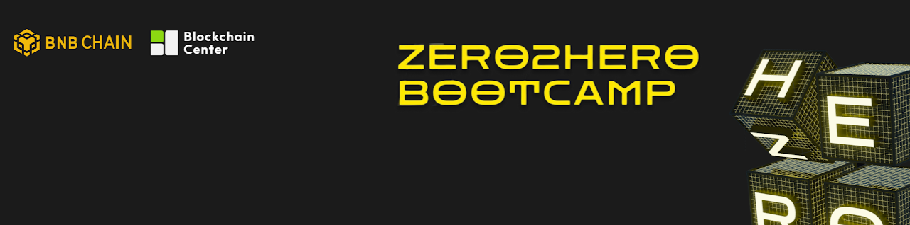

_This repository contains the completed tasks from zero2hero bootcamp_

# ZERO2HERO IN WEB3 (Bootcamp)

Full information: https://www.bnbchain.org/en/zero2hero-builder-series

- 6-week interactive course to learn Solidity from scratch and complete weekly assignments.
- Multi-language track including English, Chinese, and Russian.
- Graduate and get your NFT certificate.

# Projects
### NFT Mint and Staking 🎨

Site: https://shape-nft.netlify.app

[Github](https://github.com/kumancev/zero2hero-cis-assignments/tree/main/assignment-4-task-1)

### Web3 Booking App

Site: https://booking-dapp.netlify.app/

[GIthub](https://github.com/kumancev/zero2hero-cis-assignments/tree/main/booking-dapp)

### tBNB Bootcamp Faucet 🚰
Site: https://tbnb-faucet.vercel.app

[Github](https://github.com/kumancev/zero2hero-cis-assignments/tree/main/bnb-faucet-extra-task)

### Web3 Rock, Paper and Scissors Game 🪨🧻✂️
Site: https://rps-web3-game.vercel.app/

[Github contract](https://github.com/kumancev/zero2hero-cis-assignments/tree/main/assignment-2-task-1) |
[Github frontend](https://github.com/kumancev/zero2hero-cis-assignments/tree/main/assignment-3-task-1)

### Airdrop token 🖼️
Site: https://token-airdrop-psi.vercel.app/

[Github contract](https://github.com/kumancev/zero2hero-cis-assignments/tree/main/assignment-2-task-3) |
[Github frontend](https://github.com/kumancev/zero2hero-cis-assignments/tree/main/assignment-3-task-2/token-airdrop-frontend)

### Food Battle (Flutter app)
Site: https://foodbattle-game.web.app/

[Github](https://github.com/kumancev/zero2hero-cis-assignments/tree/main/food-battle)

### Document Signature ✍️
[Github](https://github.com/kumancev/zero2hero-cis-assignments/tree/main/assignment-2-task-2)

### Token Airdrop 🪂
[Github](https://github.com/kumancev/zero2hero-cis-assignments/tree/main/assignment-2-task-3)
