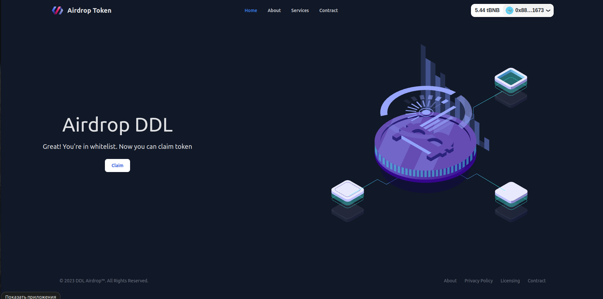

# Frontend for Airdrop token smart-contract 🖼️
Demo site: https://token-airdrop-psi.vercel.app/

## Before run app:
- You need to deploy __"Airdrop token"__ smart-contract. You can find it [here](https://github.com/kumancev/zero2hero-cis-assignments/tree/main/assignment-2-task-3) 
❗Don't forget to change the __whitelist addresses__ to yours into [deploy](https://github.com/kumancev/zero2hero-cis-assignments/blob/main/assignment-2-task-3/scripts/deploy.ts) script.

## Start app:
```shell
$ git clone https://github.com/kumancev/zero2hero-cis-assignments/tree/main/assignment-3-task-2/token-airdrop-frontend
$ npm install
$ echo 'VITE_CONTRACT_ADDRESS="PASTE_YOUR_CONTRACT_ADDRESS"' > .env
$ npm run dev
```
