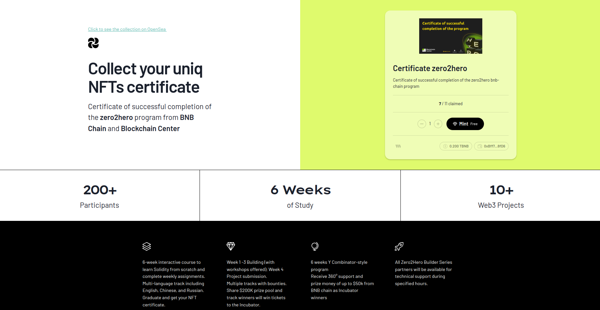

# NFT certificates and Gallery 🖼️



**Mint Site**: https://minting-z2h-certificate.vercel.app/

🤖 Smart-contract address: https://testnet.bscscan.com/address/0x0e66232e12223045d3692c664a71b06Aef9713c8

🌊 View the collection on OpenSea: https://testnets.opensea.io/collection/certificate-zero2hero-1

### ✅ What's done:

- [x] Create an NFT collection (10-1000pcs)
- [x] The metadata of each NFT must be unique
- [x] Metadata must contain information about the graduate (name, program name, grade)
- [x] Create a dApp: NFT-gallery where the user can see the NFT certificates
- [x] Add search and filter functionality to the dApp (for this use [OpenSea](https://testnets.opensea.io/collection/certificate-zero2hero-1))

- [x] It is possible to add a whitelist of wallets who can laminate NFT data.
- [x] Remove the ability to transfer NFT.
- [x] Add named certificates for each participant without or with free mints.

## Start app

```shell
$ git clone  # clone this repo
$ yarn  # install all dependencies

$ next dev  # run app in dev env
$ next build  # build your app
$ next start  # run app
$ next lint  # run lint check
```
